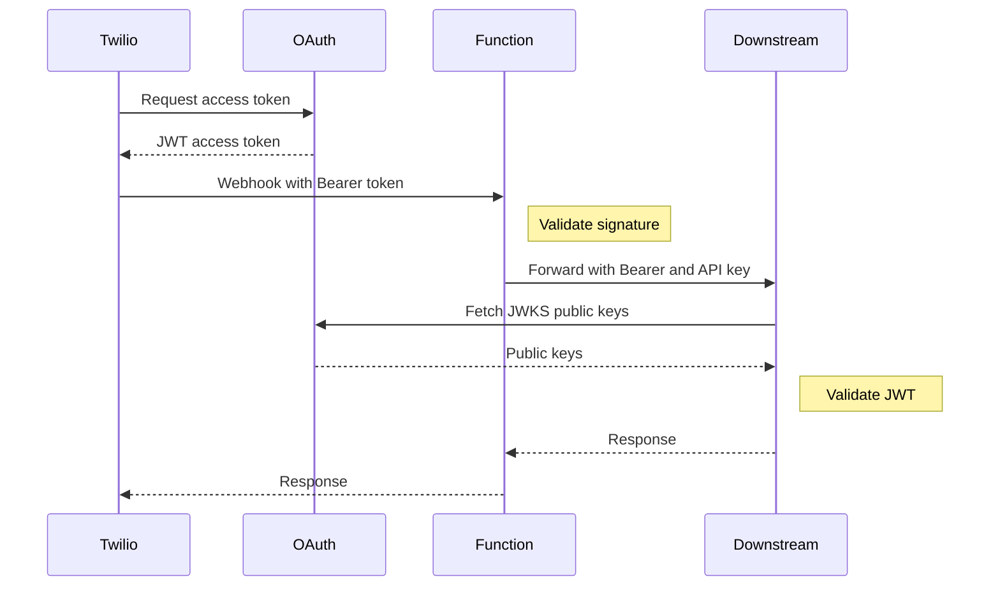

# Header Manipulation with Twilio Functions

In some architectures, your downstream webhook server requires additional authentication headers beyond the OAuth Bearer token — for example, an `X-API-Key` header that identifies the calling service. Rather than modifying Twilio's webhook configuration (which only supports OAuth tokens), you can deploy a **Twilio Function** as a lightweight proxy that sits between Twilio and your downstream service.

This pattern is useful when:
- Your downstream service requires an API key header for routing or authorization
- You want to add custom headers without modifying the downstream server's OAuth configuration
- You need a simple serverless intermediary that doesn't require managing infrastructure

## How It Works



The Twilio Function:
1. Receives the incoming webhook from Twilio (including the OAuth Bearer token)
2. Validates the `X-Twilio-Signature` to confirm the request is from your account
3. Forwards the entire payload to your downstream service
4. Adds an `X-API-Key` header from its environment configuration
5. Preserves the original `Authorization: Bearer <token>` header
6. Returns the downstream response back to Twilio

## Configuration

The `twilio-serverless/` directory contains a deployable Twilio Functions project (TypeScript). It requires the following environment variables:

| Variable | Description |
|----------|-------------|
| `ACCOUNT_SID` | Your Twilio Account SID (used for deployment) |
| `AUTH_TOKEN` | Your Twilio Auth Token (used for signature validation) |
| `DOWNSTREAM_URL` | Default URL to forward webhook payloads to (used when no `endpoint` parameter is provided) |
| `DOWNSTREAM_API_KEY` | The API key sent as `X-API-Key` to the downstream service |

Set up the project:

```bash
cd twilio-serverless
cp .env.example .env
```

Edit `.env` and fill in your values:

```bash
ACCOUNT_SID=ACxxxxxxxxxxxxxxxxxxxxxxxxxxxxxxxx
AUTH_TOKEN=your_auth_token

DOWNSTREAM_URL=https://your-downstream-service.example.com/webhook
DOWNSTREAM_API_KEY=your_downstream_api_key
```

Install dependencies:

```bash
npm install
```

## Local Development

```bash
npm start
```

The webhook endpoint will be available locally at `http://localhost:3000/webhook`.

## Deployment

Deploy using the provided script from the project root:

```bash
./scripts/deploy-serverless.sh
```

Or deploy manually from within the `twilio-serverless/` directory:

```bash
cd twilio-serverless
npm run deploy
```

After deployment, the script outputs your function URL. Point your Twilio webhook URL (or webhook rule filter) at the deployed function URL instead of your downstream server directly.

## Dynamic Endpoint Override

The function accepts an optional `endpoint` query parameter that overrides the `DOWNSTREAM_URL` environment variable. This allows you to route different webhooks to different downstream services using the same deployed function:

```
https://twilio-serverless-1234.twil.io/webhook?endpoint=https://api.example.com/voice-handler
```

If the `endpoint` parameter is not provided, the function falls back to the `DOWNSTREAM_URL` configured in the environment. This is useful when:
- You have multiple downstream services and want a single Twilio Function deployment
- Different Twilio phone numbers need to route to different backends
- You want to test against a staging URL without redeploying

## Detecting the API Key in Your Server

All three example webhook servers (TypeScript, Python, Go) will log the `X-API-Key` header if present in the incoming request. This lets you verify the Twilio Function proxy is working correctly:

```
--- Webhook received ---
Token claims: { ... }
Webhook payload: { ... }
--- X-API-Key: your_configured_key ---
```

Your downstream server can use this header for additional authorization checks, routing, or audit logging alongside the OAuth Bearer token validation.
