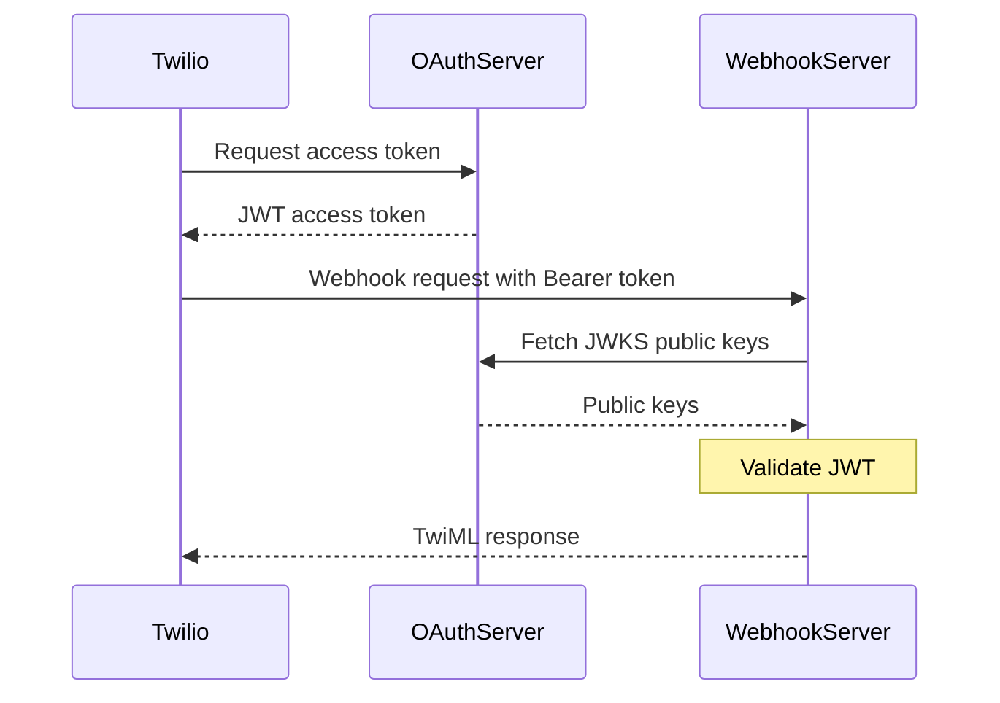
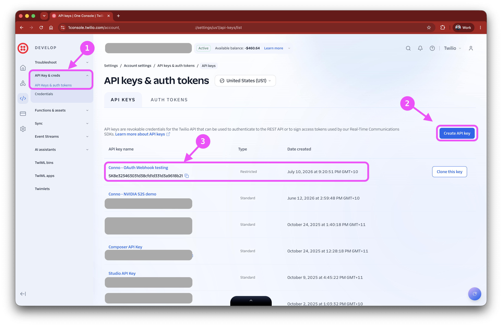

# Securing Twilio Webhooks with OAuth 2.0

Webhooks are the backbone of real-time communication applications built on Twilio. They enable your application to respond to incoming calls, messages, and other events as they happen. But how do you ensure that the webhook requests hitting your server are legitimate? How can you prove that Twilio is really Twilio before processing sensitive data?

Enter OAuth 2.0 for Twilio webhooks—a Private Beta feature that brings mutual authentication to your webhook endpoints. This guide walks you through everything you need to know to implement it in production.

## Webhooks Need Mutual Authentication

Traditionally, Twilio provides webhook signature validation via the `X-Twilio-Signature` header. Your server uses this signature to verify that requests genuinely come from Twilio. This is essential, but it's one-way: your server validates Twilio, but Twilio doesn't authenticate itself to your infrastructure.

In modern zero-trust architectures, especially when running behind API gateways, service meshes, or identity-aware proxies, you need Twilio to prove its identity **before** the request reaches your application. This is where OAuth 2.0 comes in.

With OAuth 2.0 enabled, Twilio:
1. Authenticates with your Authorization Server using client credentials
2. Obtains a short-lived access token
3. Includes that token as `Authorization: Bearer <token>` in every webhook request
4. Your infrastructure validates the token before routing the request

Your API gateway, load balancer, or service mesh can enforce authentication at the edge, and your application can still validate the token independently. `X-Twilio-Signature` is still sent alongside the Bearer token — OAuth complements signature validation, it doesn't replace it.

## How It Works: The Client Credentials Flow

Here's the sequence of events when Twilio makes an OAuth-authenticated webhook request:



**Key technical details:**
- Twilio uses the **Client Credentials** grant type (`grant_type=client_credentials`)
- Tokens are cached by Twilio and reused until they expire
- If token fetch fails, Twilio retries **2 times** with 250ms between attempts
- After 3 failures, the webhook is **dropped** and won't be retried
- After a failure, Twilio waits **300 seconds** before attempting token refresh again
- Configuration changes take up to **5 minutes** to propagate
- Error code **97001** appears in the Twilio Debugger if token acquisition fails

## Prerequisites

Before you begin, you'll need:

1. **A Twilio account enrolled in the Private Beta** for OAuth 2.0 webhook authentication. Contact your Twilio account manager or solutions engineer to request access.

2. **A Twilio API Key** with credentials (API Key SID and Secret). Create one in the [Twilio Console](https://console.twilio.com/us1/account/keys-credentials/api-keys).

   

   Since the OAuth Webhooks API is on the Preview subdomain (`preview.twilio.com`), you have two options:

   - **Standard API Key** — has access to all APIs including Preview. Simplest for testing.
   - **Restricted API Key (RAK)** — preferred for production. When creating a Restricted Key, ensure the following permissions are enabled:
     - **Webhooks** — Read & Write (required for creating and managing webhook settings)
     - **Account Settings** — Read (required for account-level configuration)

   > **We strongly recommend using Restricted API Keys (RAK) over the legacy Auth Token for all Twilio API access.** RAKs are scoped, rotatable, and individually revocable. The Auth Token is a single shared secret with full account access — if it leaks, your entire account is compromised. If the Preview API does not yet appear in the RAK permission list, use a Standard API Key for setup.

3. **An OAuth 2.0 Authorization Server** that supports the Client Credentials flow and issues JWTs. Options include:
   - **Keycloak** (open-source, self-hosted)—great for local development and testing. See `infra/` in this repository for a Docker Compose setup.
   - **Auth0**—managed service, excellent developer experience. See `docs/auth0-setup.md`.
   - **Okta**—enterprise-grade identity platform. See `docs/okta-setup.md`.
   - **Microsoft Entra ID** (formerly Azure AD)—native Azure integration. See `docs/entra-setup.md`.

4. **ngrok or a public URL** to expose your local webhook server during development.

## Step-by-Step Setup

This repository provides a complete reference implementation with bash, PowerShell, and Windows batch scripts that automate the entire configuration process. Here's how to use them.

### 1. Set Up Your OAuth Authorization Server

Before configuring anything else, you need a running OAuth 2.0 Authorization Server. This is where Twilio will request access tokens, and where your webhook server will validate them.

**For local development** — use the included Keycloak Docker setup:

```bash
docker compose -f infra/docker-compose.yml up -d
./infra/keycloak-setup.sh
```

The setup script will output the values you need:

```
OAUTH_TOKEN_URL=http://localhost:8080/realms/master/protocol/openid-connect/token
OAUTH_CLIENT_ID=twilio-webhook-client
OAUTH_CLIENT_SECRET=<generated-secret>
OAUTH_JWKS_URI=http://localhost:8080/realms/master/protocol/openid-connect/certs
OAUTH_ISSUER=http://localhost:8080/realms/master
```

Since Twilio needs to reach both your OAuth server and your webhook server over the internet, you'll need **two ngrok tunnels** — one for each local service.

> **Important:** The Docker Compose includes `KC_PROXY_HEADERS: xforwarded` so that Keycloak correctly uses `https://` in the token issuer (`iss` claim) when accessed through ngrok. Without this, the token would contain `http://` as the issuer, causing an issuer mismatch when your webhook server validates the token. If you see an "invalid issuer" error, ensure Keycloak was started with this setting and that your `OAUTH_ISSUER` in `.env` uses `https://`.

**Option A: ngrok config file (recommended)**

Create or edit `~/.ngrok2/ngrok.yml` (or `~/Library/Application Support/ngrok/ngrok.yml` on macOS):

```yaml
tunnels:
  keycloak:
    addr: 8080
    proto: http
  webhook:
    addr: 3000
    proto: http
```

Then start both tunnels at once:

```bash
ngrok start --all
```

You'll see two forwarding URLs in the output — one for each service.

**Option B: two separate terminals**

```bash
# Terminal 1 — Keycloak (OAuth server)
ngrok http 8080

# Terminal 2 — Webhook server
ngrok http 3000
```

Copy the Keycloak ngrok URL and use it in place of `http://localhost:8080` in the OAuth values above. Copy the webhook ngrok URL for `WEBHOOK_URL` in Step 2.

**For production**, use a managed provider instead (no ngrok needed for the OAuth server) — see the setup guides for [Auth0](docs/auth0-setup.md), [Okta](docs/okta-setup.md), or [Microsoft Entra ID](docs/entra-setup.md). Each guide ends with the exact `.env` values to use.

### 2. Configure Your Environment

Now that you have your OAuth server running and know its URLs, copy `.env.example` to `.env`:

```bash
cp .env.example .env
```

```powershell
Copy-Item .env.example .env
```

```bat
copy .env.example .env
```

Fill in your credentials. Here's what a complete `.env` looks like with Keycloak via ngrok:

```bash
# Twilio credentials
TWILIO_API_KEY_SID=SKxxxxxxxxxxxxxxxxxxxxxxxxxxxxxxxx
TWILIO_API_KEY_SECRET=your_api_key_secret
TWILIO_ACCOUNT_SID=ACxxxxxxxxxxxxxxxxxxxxxxxxxxxxxxxx

# OAuth 2.0 Authorization Server (used by Twilio to fetch tokens)
# These come from Step 1 — your OAuth server setup
OAUTH_TOKEN_URL=https://your-keycloak.ngrok.app/realms/master/protocol/openid-connect/token
OAUTH_CLIENT_ID=twilio-webhook-client
OAUTH_CLIENT_SECRET=your_generated_secret
OAUTH_SCOPE=           # Optional, depends on your provider
OAUTH_AUDIENCE=        # Optional, depends on your provider

# Webhook server (used by your application to validate tokens)
WEBHOOK_PORT=3000
WEBHOOK_URL=https://your-webhook.ngrok.app/webhook
OAUTH_JWKS_URI=https://your-keycloak.ngrok.app/realms/master/protocol/openid-connect/certs
OAUTH_ISSUER=https://your-keycloak.ngrok.app/realms/master

# Auto-populated by create-setting.sh
WEBHOOK_SETTING_SID=
```

**Note the two sets of OAuth variables:**
- `OAUTH_TOKEN_URL`, `OAUTH_CLIENT_ID`, `OAUTH_CLIENT_SECRET`: Used by Twilio to obtain tokens from your auth server
- `OAUTH_JWKS_URI`, `OAUTH_ISSUER`: Used by your webhook server to validate the tokens Twilio sends

**Important:** Both `OAUTH_TOKEN_URL`/`OAUTH_JWKS_URI` and `WEBHOOK_URL` must be publicly reachable by Twilio. If you're developing locally, you'll need ngrok (or similar) for both your OAuth server and your webhook server.

### 3. Create a Webhook Setting

Run the create-setting script to create a webhook setting resource in your Twilio account:

```bash
./scripts/create-setting.sh
```

```powershell
.\scripts\create-setting.ps1
```

```bat
scripts\create-setting.bat
```

This script:
- Creates a new webhook setting via `POST /Webhooks/Settings`
- Extracts the SID from the response
- Updates your `.env` file with `WEBHOOK_SETTING_SID`

Under the hood:

```bash
curl -X POST https://preview.twilio.com/Webhooks/Settings \
  -H 'Content-Type: application/json' \
  -u "${TWILIO_API_KEY_SID}:${TWILIO_API_KEY_SECRET}" \
  -d '{"name": "Default Webhook Settings"}'
```

> **Troubleshooting: 404 "The requested resource /Webhooks/Settings was not found"**
>
> This error means your account has not been enrolled in the OAuth Webhooks Private Beta. The `/Webhooks/Settings` endpoint is only available on accounts that have been explicitly activated by Twilio. Contact your Twilio account manager or solutions engineer and provide your Account SID (`ACxxx`) to request activation. Once enrolled, the endpoint will respond normally.

### 4. Attach OAuth 2.0 Configuration

Run the configure-oauth script to attach OAuth credentials to your webhook setting:

```bash
./scripts/configure-oauth.sh
```

```powershell
.\scripts\configure-oauth.ps1
```

```bat
scripts\configure-oauth.bat
```

This script:
- Reads your OAuth configuration from `.env`
- PATCHes the webhook setting with `auth.type: "oauth2"`
- Includes token URL, client ID, client secret, and optional scope/audience

The request payload looks like:

```json
{
  "auth": {
    "enabled": true,
    "type": "oauth2",
    "oauth2": {
      "token_url": "https://your-auth-server/oauth/token",
      "client_id": "your_client_id",
      "client_secret": "your_client_secret",
      "scope": "optional_scope",
      "audience": "optional_audience"
    }
  }
}
```

### 5. Test the Configuration

Before enabling the setting for all webhooks, validate that Twilio can successfully authenticate and reach your webhook server.

**First, start one of the webhook servers** in a separate terminal from the project root (pick whichever language you prefer — they all do the same thing):

```bash
# Option 1: TypeScript (install once, then re-run the second command to restart)
npm --prefix servers/typescript install
npm --prefix servers/typescript run dev

# Option 2: Python (install once, then re-run the last command to restart)
python3 -m venv servers/python/.venv
source servers/python/.venv/bin/activate
pip install -r servers/python/requirements.txt
python3 servers/python/server.py

# Option 3: Go (build once, then re-run the last command to restart)
go -C servers/golang build -o golang-server .
./servers/golang/golang-server
```

Make sure your webhook ngrok tunnel is running and `WEBHOOK_URL` in `.env` points to it.

**Then run the test:**

```bash
./scripts/test-webhook.sh
```

```powershell
.\scripts\test-webhook.ps1
```

```bat
scripts\test-webhook.bat
```

This invokes the `/Webhooks/Settings/{Sid}/Test` endpoint, which:
- Fetches an access token from your OAuth server using the configured credentials
- Sends a test webhook request to your `WEBHOOK_URL` with the token
- Returns success (200) if your server accepted the request

> **You can skip this step** if your webhook server isn't ready yet. The test is optional — you can still enable the setting as default in Step 6 and test with a real Voice or Messaging webhook later. However, skipping means you won't catch configuration issues (wrong token URL, invalid credentials, unreachable server) until live traffic arrives.

If this fails, check:
- The **Twilio Console Debugger** for error code 97001 (token fetch failure)
- Your OAuth server logs to verify the token request arrived
- Your webhook server logs to verify the token validation logic
- That both ngrok tunnels are running (OAuth server and webhook server)

### 6. Create a Webhook Rule

Webhook Settings are applied to your webhooks via **Webhook Rules**. A rule matches outgoing webhook URLs against a filter pattern and applies your setting to matching requests.

```bash
./scripts/create-rule.sh
```

```powershell
.\scripts\create-rule.ps1
```

```bat
scripts\create-rule.bat
```

By default this creates a catch-all rule (filter `*`, priority `100`, traffic `100%`) that applies your OAuth setting to all webhooks. You can also target specific URLs:

```bash
# Apply only to a specific domain
./scripts/create-rule.sh 'https://your-webhook.ngrok.app/*' 100 100
```

```powershell
# Apply only to a specific domain
.\scripts\create-rule.ps1 -Filter 'https://your-webhook.ngrok.app/*' -Priority 100 -TrafficPercentage 100
```

```bat
REM Apply only to a specific domain
scripts\create-rule.bat "https://your-webhook.ngrok.app/*" 100 100
```

The script saves the `WEBHOOK_RULE_SID` to your `.env` for later management.

Under the hood:

```bash
curl -X POST https://preview.twilio.com/Webhooks/Rules \
  -H 'Content-Type: application/json' \
  -u "${TWILIO_API_KEY_SID}:${TWILIO_API_KEY_SECRET}" \
  -d '{
    "webhook_setting_sid": "{WEBHOOK_SETTING_SID}",
    "filter": "*",
    "priority": 100,
    "traffic_percentage": 100
  }'
```

**Important:**
- Changes take up to **5 minutes** to take effect.
- Rules are evaluated by priority (lowest number first). The first matching rule wins.
- If no rule matches a webhook URL, the webhook is sent without OAuth.
- You can create up to 20 rules per account.
- Use `traffic_percentage` for gradual rollouts (e.g., start at 10%, increase over time).

## Building the Webhook Server

Now that Twilio is sending OAuth tokens, your webhook server needs to validate them. Here's a production-ready implementation in TypeScript using Express and the `jose` library.

### Why `jose`?

The `jose` library (JavaScript Object Signing and Encryption) is the modern standard for JWT validation in Node.js. It:
- Automatically fetches and caches public keys from your OAuth server's JWKS endpoint
- Validates token signatures using the correct algorithm
- Checks expiration, issuer, and audience claims
- Handles key rotation seamlessly

Install dependencies:

```bash
npm install express jose dotenv
npm install --save-dev @types/express @types/node typescript
```

### The Middleware Pattern

Here's the complete server from `servers/typescript/src/server.ts`:

```typescript
import "dotenv/config";
import express, { Request, Response, NextFunction } from "express";
import { createRemoteJWKSet, jwtVerify, JWTPayload } from "jose";

const PORT = parseInt(process.env.WEBHOOK_PORT || "3000", 10);
const JWKS_URI = process.env.OAUTH_JWKS_URI;
const ISSUER = process.env.OAUTH_ISSUER;

if (!JWKS_URI) {
  console.error("OAUTH_JWKS_URI is required in .env");
  process.exit(1);
}

const JWKS = createRemoteJWKSet(new URL(JWKS_URI));

interface AuthenticatedRequest extends Request {
  token?: JWTPayload;
}

async function validateToken(
  req: AuthenticatedRequest,
  res: Response,
  next: NextFunction
): Promise<void> {
  const authHeader = req.headers.authorization;

  if (!authHeader || !authHeader.startsWith("Bearer ")) {
    res.status(401).json({ error: "Missing or invalid Authorization header" });
    return;
  }

  const token = authHeader.slice(7);

  try {
    const { payload } = await jwtVerify(token, JWKS, {
      issuer: ISSUER || undefined,
    });
    req.token = payload;
    next();
  } catch (err) {
    console.error("Token validation failed:", err);
    res.status(401).json({ error: "Invalid token" });
  }
}

const app = express();
app.use(express.urlencoded({ extended: true }));
app.use(express.json());

app.all("/webhook", validateToken, (req: AuthenticatedRequest, res: Response) => {
  console.log("--- Webhook received ---");
  console.log("Token claims:", JSON.stringify(req.token, null, 2));
  console.log("Webhook payload:", JSON.stringify(req.body, null, 2));

  // Determine if this is a Voice or Messaging webhook
  const isVoice = req.body.CallSid || req.body.CallStatus;

  if (isVoice) {
    res.type("text/xml").send(`<?xml version="1.0" encoding="UTF-8"?>
<Response>
  <Say>Hello! This webhook is protected by OAuth 2.0.</Say>
</Response>`);
  } else {
    res.type("text/xml").send(`<?xml version="1.0" encoding="UTF-8"?>
<Response>
  <Message>Hello! This webhook is protected by OAuth 2.0.</Message>
</Response>`);
  }
});

app.get("/health", (_req: Request, res: Response) => {
  res.json({ status: "ok" });
});

app.listen(PORT, () => {
  console.log(`Webhook server listening on port ${PORT}`);
  console.log(`JWKS URI: ${JWKS_URI}`);
  console.log(`Issuer: ${ISSUER || "(not set)"}`);
});
```

### Key Implementation Details

**1. JWKS Initialization**  
`createRemoteJWKSet(new URL(JWKS_URI))` creates a remote key set that automatically:
- Fetches public keys from your OAuth server
- Caches them in memory
- Refreshes them when needed (e.g., key rotation)

**2. Token Extraction**  
The middleware extracts the Bearer token from the `Authorization` header. If missing or malformed, it returns 401.

**3. Token Verification**  
`jwtVerify()` performs cryptographic validation:
- Verifies the signature using the correct public key from JWKS
- Checks that `exp` (expiration) hasn't passed
- Validates the `iss` (issuer) claim matches your expected issuer
- Optionally validates `aud` (audience) if configured

**4. Attaching Claims**  
If validation succeeds, the JWT payload (claims) is attached to `req.token` for downstream handlers to inspect (e.g., `sub`, `client_id`, custom claims).

**5. Returning TwiML**  
Twilio expects an XML response (TwiML) for Voice and Messaging webhooks. The handler detects the webhook type and returns appropriate TwiML.

### Python Implementation

A functionally equivalent FastAPI implementation is provided in `servers/python/server.py` using the `python-jose` library. The pattern is identical:
- Extract Bearer token from `Authorization` header
- Fetch JWKS from your OAuth server
- Verify signature, expiration, and issuer
- Return TwiML on success, 401 on failure

See the Python server for details.

### Go Implementation

The Go implementation in `servers/golang/main.go` uses [`golang-jwt`](https://github.com/golang-jwt/jwt) for JWT validation with automatic JWKS key fetching.

Key libraries:
- `github.com/MicahParks/keyfunc/v3` — fetches and caches JWKS keys automatically
- `github.com/golang-jwt/jwt/v5` — parses and verifies JWTs

The pattern is the same as TypeScript and Python: middleware extracts the Bearer token, validates the JWT signature against JWKS, checks issuer/expiry, and passes claims to the webhook handler.

See the Go server for the complete implementation.

## Testing End-to-End with Keycloak

For local development and testing, this repository includes a Keycloak setup that runs in Docker Compose.

### 1. Start Keycloak

```bash
docker compose -f infra/docker-compose.yml up -d
```

Keycloak will be available at `http://localhost:8080`. Default admin credentials: `admin` / `admin`.

### 2. Configure Keycloak

Run the setup script to create a realm, client, and service account:

```bash
./infra/keycloak-setup.sh
```

This script:
- Creates a `twilio-webhooks` realm
- Creates a `twilio-client` with Client Credentials flow enabled
- Outputs the client secret to copy into your `.env`

Update your `.env`:

```bash
OAUTH_TOKEN_URL=http://localhost:8080/realms/twilio-webhooks/protocol/openid-connect/token
OAUTH_CLIENT_ID=twilio-client
OAUTH_CLIENT_SECRET=<secret from setup script>
OAUTH_JWKS_URI=http://localhost:8080/realms/twilio-webhooks/protocol/openid-connect/certs
OAUTH_ISSUER=http://localhost:8080/realms/twilio-webhooks
```

### 3. Start the Webhook Server

```bash
npm --prefix servers/typescript install
npm --prefix servers/typescript run dev
```

The server will start on port 3000.

### 4. Expose with ngrok

You need two tunnels — one for Keycloak (if not already running from Step 1) and one for your webhook server. The easiest way is:

```bash
ngrok start --all
```

Or in separate terminals:

```bash
# Terminal 1 — Keycloak (if not already tunneled)
ngrok http 8080

# Terminal 2 — Webhook server
ngrok http 3000
```

Update your `.env` with both ngrok URLs:

```bash
# Replace localhost:8080 URLs with the Keycloak ngrok URL
OAUTH_TOKEN_URL=https://your-keycloak.ngrok.app/realms/master/protocol/openid-connect/token
OAUTH_JWKS_URI=https://your-keycloak.ngrok.app/realms/master/protocol/openid-connect/certs
OAUTH_ISSUER=https://your-keycloak.ngrok.app/realms/master

# Use the webhook ngrok URL
WEBHOOK_URL=https://your-webhook.ngrok.app/webhook
```

### 5. Configure Twilio

Run the setup script to create the webhook setting, attach OAuth, test, and enable:

```bash
./scripts/setup.sh
```

This is a convenience wrapper that runs all four scripts in sequence.

### 6. Trigger a Webhook

Make a test phone call or send an SMS to a Twilio number configured to call your webhook URL. Check your server logs—you should see:

```
--- Webhook received ---
Token claims: {
  "iss": "http://localhost:8080/realms/twilio-webhooks",
  "sub": "service-account-twilio-client",
  "exp": 1720654321,
  ...
}
Webhook payload: {
  "CallSid": "CAxxxxxxxxxxxxxxxxxxxxxxxxxxxxxxxx",
  "From": "+15551234567",
  ...
}
```

The token claims prove that Twilio successfully authenticated with Keycloak and your server validated the JWT.

## Production Considerations

### Use a Managed Provider

For production, **do not self-host your Authorization Server** unless you have a dedicated SRE team. Use a managed provider:
- **Auth0**: Zero-config Client Credentials flow, excellent API performance, global CDN for JWKS
- **Okta**: Enterprise identity platform with SLA guarantees
- **Microsoft Entra ID**: Native integration with Azure infrastructure

See `docs/auth0-setup.md`, `docs/okta-setup.md`, or `docs/entra-setup.md` for setup instructions.

### Token Lifetime Trade-offs

Shorter token lifetimes are more secure (reduced replay window), but increase the frequency of token refresh requests to your OAuth server. Longer tokens reduce load on your OAuth server but increase risk if a token is compromised.

**Recommended settings:**
- **Development**: 3600 seconds (1 hour)
- **Production**: 300-900 seconds (5-15 minutes)

Most providers let you configure this in the client settings (e.g., "Access Token Lifetime").

### Retry and Failure Handling

Twilio's retry behavior is aggressive but limited:
- **2 retries** with 250ms between attempts
- **3 total attempts** (1 initial + 2 retries)
- If all fail, the webhook is **dropped** (not queued)
- After failure, Twilio waits **300 seconds** before retrying token fetch

**Implications:**
- Your OAuth server must respond quickly (< 100ms) to avoid timeouts
- Monitor token fetch failures via Twilio Debugger error code 97001
- Transient OAuth server downtime can cause webhook loss

**Mitigation:**
- Use a high-availability OAuth provider (Auth0, Okta, Entra)
- Set up OAuth server health monitoring and alerting
- Consider enabling Twilio Event Streams for audit/replay of dropped webhooks (note: Event Streams Webhook Sinks themselves don't support OAuth)

### OAuth and Signature Validation Are Independent

OAuth 2.0 does **not** replace `X-Twilio-Signature` validation. Both are sent and work independently:

- **OAuth token** proves the request came from an authenticated client (Twilio)
- **X-Twilio-Signature** proves the request payload has not been tampered with

You can configure both for additional security. Twilio recommends using at least one of them with HTTPS.

> **Note:** The `/Test` endpoint does not send the `X-Twilio-Signature` header. Real webhooks (Voice, Messaging) include both the Bearer token and the signature.

### Why Restricted API Keys (RAK) Over Auth Token?

You still need an API Key to *configure* OAuth via the Twilio API (as the setup scripts do). Always use a Restricted API Key for this — not the legacy Auth Token.

|                | Auth Token (Legacy)                            | Restricted API Key (RAK)                      |
| -------------- | ---------------------------------------------- | --------------------------------------------- |
| **Scope**      | Full account access                            | Scoped to specific permissions                |
| **Rotation**   | Requires regeneration, breaks all integrations | Create new key, deprecate old — zero downtime |
| **Revocation** | Cannot revoke without disrupting services      | Revoke individual keys instantly              |
| **Audit**      | Single shared secret                           | Per-integration keys with clear ownership     |

### Monitoring and Observability

Log token validation failures separately from other errors. Include:
- Reason for failure (expired, invalid signature, wrong issuer)
- Token `jti` (JWT ID) for correlation with OAuth server logs
- Webhook type (Voice, Messaging) and associated SID

Example structured log:

```json
{
  "level": "warn",
  "message": "Token validation failed",
  "reason": "expired",
  "jti": "abc123",
  "call_sid": "CAxxxxxxxxxxxxxxxxxxxxxxxxxxxxxxxx"
}
```

Set up alerts for:
- Token validation failure rate > 1%
- Twilio Debugger error code 97001 (token fetch failure)
- OAuth server response time > 200ms

## FAQ Highlights

**Does OAuth work with production traffic?**  
Yes. This is a Private Beta feature, but it's production-ready for accounts enrolled in the program.

**Which Twilio products support OAuth webhooks?**  
Voice, Messaging, and most other Twilio products. **Not supported:** Event Streams Webhook Sinks.

**How long do configuration changes take to propagate?**  
Up to **5 minutes** after creating or updating a webhook rule.

**Does OAuth override Restricted API Key (RAK) Signature configuration?**  
No. RAK signature validation and OAuth 2.0 are compatible and work independently. You can configure both for additional security.

**What happens if my OAuth server goes down?**  
Twilio will retry token fetch 2 times (250ms apart). After 3 failures, the webhook is dropped. Twilio then waits 300 seconds before attempting token refresh again. Use a high-availability OAuth provider to minimize this risk.

**Can I inspect tokens in the Twilio Debugger?**  
No. Tokens are not logged. However, error code **97001** indicates a token fetch failure. Check your OAuth server logs for details.

**Is X-Twilio-Signature still sent when OAuth is enabled?**  
**Yes.** OAuth and signature validation are independent. Real webhooks include both the Bearer token and the `X-Twilio-Signature` header. You can validate both for defense-in-depth. Note: the `/Test` endpoint does not include the signature header.

## Next Steps

You now have a complete understanding of how to secure Twilio webhooks with OAuth 2.0. Here's what to do next:

1. **Request Private Beta access** from your Twilio account team if you haven't already.
2. **Set up a test environment** using the Keycloak Docker Compose setup in this repository.
3. **Deploy the TypeScript, Python, or Go webhook server** to your infrastructure.
4. **Choose a production OAuth provider** (Auth0, Okta, or Entra) and follow the setup guide in `docs/`.
5. **Run the scripts** to create, configure, test, and enable your webhook setting.
6. **Monitor** token validation success rates and OAuth server health.
7. **Iterate** on token lifetimes based on your security and performance requirements.

For questions, issues, or feedback, open an issue in this repository or contact your Twilio solutions engineer.

Welcome to the future of webhook security.
